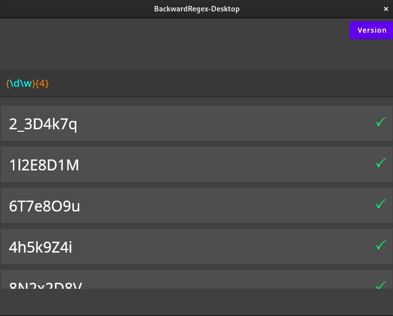

#  BackwardRegex Desktop

BackwardRegex Desktop is a desktop application that takes in a regular expression and generates sample texts that match
it.

For example, if you input `(\d\w){4}`, this is what can come out.

This application is a graphic wrapper of the [BackwardRegex library](https://github.com/MaxBuster380/BackwardRegex).

Note the green checkmark on the right. This indicates that the generated text does indeed match the given regular
expression.
If that verification failed, feel free to notify us with the regular expression and the generated text.